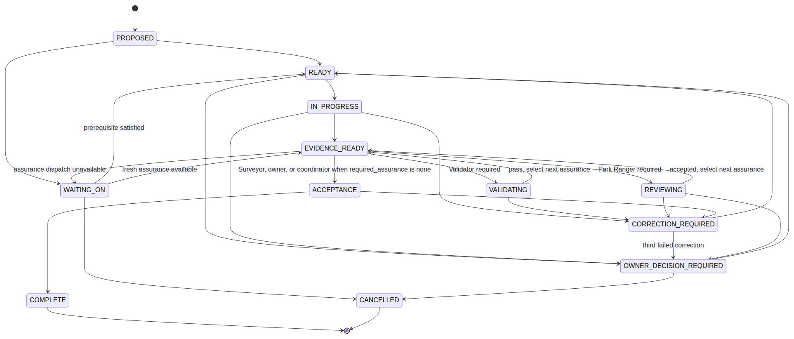
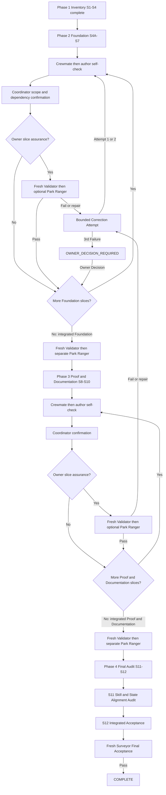

# Bearing Lite

[](https://www.npmjs.com/package/@alphazede/bearing-lite)
[](LICENSE-APACHE)

**Bearing Lite** (`@alphazede/bearing-lite`) is a skills-first Agent Plugin for
planning, routing, bounded execution, and independent review of repository work.
It ships portable skills, references, templates, and optional client hooks.

An agent cannot certify its own work. The stateful Router owns the planning
conversation and visible Journey state, then dispatches fresh bounded sessions.
Independent assurance runs at the owner's selected cadence: per slice, per
execution/correction round, or once at the end. Owner Authority remains human-only.

Bearing Lite was created by William Rumph.

## Install

Install as an Agent Plugin in a compatible client (for example Codex or Claude
Code marketplaces that discover Agent Plugins `plugin.json` and `skills/`).

```sh
# Example: npm package for packaging and inspection
npm pack @alphazede/bearing-lite
```

Client install names follow the host plugin UI. The portable identity is always
`bearing-lite` / `@alphazede/bearing-lite`. No postinstall script, global hook
copy, or host-config mutation is required.

Node.js is not required to *use* the skills. Optional typed hook adapters under
`hooks/` run only when a client registers them; hookless clients remain
first-class and use procedural skill checks.

## What it does

1. **Ask** whether the Journey is an Explorer Journey or an Expedition.
2. **Fill only missing planning stages:** Repository Fit → Set Bearings → Gather
   Supplies → Map the Route.
3. **Confirm** the user-owned primary/fallback lineup and review cadence.
4. **Dispatch fresh sessions** with bounded context, authority, and return types.
5. **Record state visibly** in human-readable Markdown artifacts only.

Bearing Lite never selects models, providers, credentials, or launchers. The
owner provides each role's primary/fallback agent or harness, model, and
reasoning level in `~/.agents/bearing-lite/default-role-lineup.md`, then confirms
the applicable Journey snapshot before implementation.

## Routes and scaling

| Route | When | Cost |
|---|---|---|
| **Explorer Journey** | One bounded packet or one wave | Direct Crewmate or one Explorer |
| **Expedition** | Multi-phase or concurrent independent lanes | Navigator; Trail Boss only for concurrent/conflicting waves |

An **Explorer Journey** uses a direct Crewmate for one ready packet or one
Explorer over a compact/sequential wave.
**Expedition** adds navigation (and sometimes a Trail Boss) so independent lanes
stay small and sharp instead of degrading in one long context. Either shape can
use substantial tokens; the product does not impose a default budget ceiling.

### Role routing (explanatory)

Current routing diagram source: [`skills/bearing-lite/references/role-routing.mmd`](skills/bearing-lite/references/role-routing.mmd).
The text below remains authoritative for clients that do not render Mermaid.

**Authoritative text (vision optional):** Owner Authority remains human-only. The
Bearing Lite Router is the stateful planning controller, not a work role. It
invokes only missing planning stages in fresh sessions, confirms the owner's
lineup and cadence, then dispatches an Explorer Journey or Expedition. Nested
Sub-Explorer opens only for proven-independent lanes. Validator, Park Ranger,
and Surveyor appear only when declared and when the selected per-slice,
per-round, or at-end boundary is reached. Diagrams explain orientation; they
never authorize a transition.

## Roles and authority

| Role | What it is | Executes | Notes |
|---|---|---|---|
| **Router** | Stateful planning controller | no | User-facing; planning-state writer |
| **Navigator** | Expedition orchestrator | no | Owns cross-wave sequencing |
| **Trail Boss** | Multi-wave controller | no | Only concurrent or conflicting waves |
| **Explorer** | One-wave controller | no | Dispatches Crewmates |
| **Sub-explorer** | Nested lane controller | no | Only when lanes are proven independent |
| **Crewmate** | Bounded implementer | yes | Most hands-on work; exact write set |
| **Validator** | Evidence sufficiency | no | Independent of the author |
| **Park Ranger** | Defect review | no | Independent of the author |
| **Surveyor** | User-facing acceptance | no | Read-only outcome judgment |
| **Owner Authority** | Human decision | n/a | Never an agent role |

**Independent review:** a candidate author never provides their own Validator,
Park Ranger, or Surveyor verdict.

Failure escalates to the nearest role whose scope can see it:

| Failure scope | Escalates to |
|---|---|
| Within one slice or packet | Explorer or nearest parent |
| Across slices in a wave | Trail Boss when present, else Navigator |
| Across phases | Navigator |
| Contract, security, or authority change | Owner Authority |

## Task state (explanatory)



Reviewable Mermaid source: [`skills/bearing-lite/references/task-state.mmd`](skills/bearing-lite/references/task-state.mmd).
Authoritative transition rules: [`skills/bearing-lite/references/task-state.md`](skills/bearing-lite/references/task-state.md).

**Authoritative summary:** The project's plan is the only task-state record.
Normal progress is `PROPOSED` → `READY` → `IN_PROGRESS` → `EVIDENCE_READY`, then
optional `VALIDATING` / `REVIEWING` when required, then `ACCEPTANCE` →
`COMPLETE`. `WAITING_ON` holds for missing prerequisites or assurance dispatch.
`CORRECTION_REQUIRED` allows two in-authority repairs; a third failed correction
escalates to `OWNER_DECISION_REQUIRED`. Diagrams never create state or authorize
transitions.

## Implementation process (explanatory)

Owner-approved multi-phase work follows four phases: Inventory, Foundation,
Proof and Documentation, and Final Audit. Default slice completion is author
self-check plus coordinator confirmation when `required_assurance` is `none`.
Fresh Validator then separate Park Ranger is mandatory only on exact integrated
phase candidates, not on every packet.


Mermaid source:
[`docs/plans/2026-08-09-bearing-skills-first-architecture/assets/implementation-process.mmd`](docs/plans/2026-08-09-bearing-skills-first-architecture/assets/implementation-process.mmd).

<details>
<summary>Diagram source (implementation process)</summary>



</details>

## Package layout

| Path | Purpose |
|---|---|
| `plugin.json` | Agent Plugins v1.0.0 manifest |
| `skills/` | Router, planning stages, and role skills |
| `hooks/` | Optional client-specific sequencing adapters |
| `README.md` and governance docs | Public product and conduct surfaces |

There is no `mcp.json`, `bin` entrypoint, postinstall, or runtime dependency on
another product's state.

## Provider neutrality

Skills declare **capabilities** (reasoning depth, repository access, mutation
tools, independence, optional vision). They never pin a model, provider API key,
default route, or launcher. Owners and clients choose how to satisfy each role.

## Contributing

Issues and carefully scoped pull requests help. See
[CONTRIBUTING.md](CONTRIBUTING.md). Everyone is covered by the
[Code of Conduct](CODE_OF_CONDUCT.md).

## Security

Report suspected vulnerabilities privately—not in a public issue. See
[SECURITY.md](SECURITY.md).

## License

Licensed under the [Apache License 2.0](LICENSE-APACHE).
