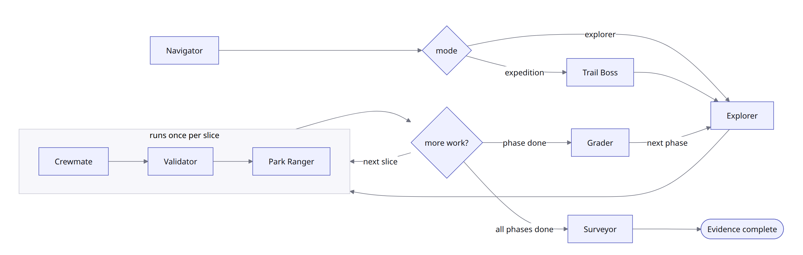
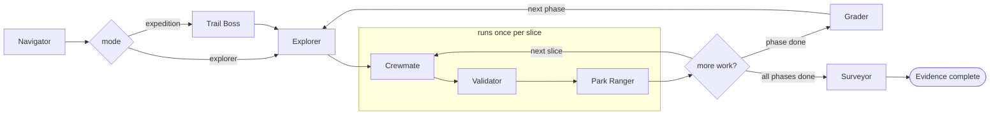

# Bearing

[](https://www.npmjs.com/package/@alphazede/bearing)
[](https://github.com/alphazede/bearing/actions/workflows/bearing-quality.yml)
[](LICENSE-APACHE)


Bearing is a local browser control room for evidence-backed agent work. It moves
a complex repository request through approved planning, bounded execution, owner
decisions, and reviewable evidence, and you keep approval and review authority
throughout.

**An agent cannot certify its own work.** Every change runs inside a declared
write set, produces a receipt bound to the runtime that validated it, and is
reviewed by a role that structurally cannot execute.

Bearing is packaged for Codex and Claude Code and was created by William Rumph
at AlphaZede. The public npm package is `@alphazede/bearing`.

## The two journeys

Bearing plans first and executes second. Once a plan is approved you choose the
shape of the run, and that choice is yours rather than the product's.

**Explorer** puts one lane controller over a set of bounded Crewmates. It is the
smaller shape, using fewer agents and fewer tokens, and it suits work that is
compact or mostly sequential. The cost is that one controller carries the whole
coordination load, so there is little parallelism to gain.

**Expedition** adds a Navigator above a Trail Boss and runs several lanes at
once. It fits multi-phase work whose lanes are genuinely independent. The cost
is real, since more controllers means more coordination and more tokens.

The deeper reason to reach for Expedition is context. Every agent degrades as its
context window fills, so splitting work across more controllers keeps each one
small and sharp on the piece it owns. You are buying focus with coordination.

<table>
<tr>
<td width="50%"></td>
<td width="50%"></td>
</tr>
<tr>
<td><b>Explorer: focused route, fewer sessions.</b> Best for compact or mostly sequential plans. Tradeoff: less parallelism.</td>
<td><b>Expedition: parallel ascent, more sessions.</b> Best for independent lanes or multiple phases. Tradeoff: higher token and coordination cost.</td>
</tr>
</table>

Either shape can use substantial tokens. Bearing shows a persistent warning
rather than imposing a default ceiling, and `--budget` sets a per-call
acceptance ceiling. See [execution modes](guide/execution-modes.md) for the
scoring contract behind the choice.

## Roles and authority

Bearing names its roles after an expedition, so the second column says what each
one actually is.

| Role | What it is | Executes | Default tier | Constraint |
|---|---|---|---|---|
| **Navigator** | Orchestrator. Owns the planning plane and coordinates the Expedition | yes | `high` | No network, no external action, context off |
| **Trail Boss** | Expedition controller. Runs the wave graph across lanes | yes | `medium` | Expedition only, never paired with Explorer mode |
| **Explorer** | Lane controller. Runs one lane and dispatches its implementers | yes | `medium` | Read-only authority, no write tools |
| **Sub-explorer** | Nested lane controller. Opened when one lane needs to split again | yes | `medium` | Complex work only, inherits the Explorer boundary |
| **Crewmate** | Implementer. Writes the code for one bounded slice | yes | `medium` | Writes only inside the Focus envelope |
| **Validator** | Evidence validator. Checks the contract was actually proven | yes | `high` | Verdict is `PASS`, `NEEDS_MORE_EVIDENCE`, or `FAIL` |
| **Park Ranger** | Code reviewer. Hunts defects introduced by the diff | yes | `high` | Findings ranked `P0` through `P3` |
| **Grader** | Quality scorer. Rates the finished result against a rubric | yes | `high` | Frozen rubric v1, each dimension 0 through 4 |
| **Surveyor** | Acceptance reviewer. Judges whether it works for the user | no | `medium` | Read-only, no network, no search, context off |

Trail Boss, Explorer, and Sub-explorer are a swarm. Splitting work across more
controllers keeps each agent's context window small, so every agent stays
functional on the part it owns instead of degrading as one long context fills up.

Seven of these ship as packaged skills in `skills/`. Trail Boss and Sub-explorer
are roles in the execution graph instead, and that graph is implemented and
tested but is not yet what the browser journey schedules.

A failure escalates to the nearest role whose scope can actually see it:

| Failure scope | Escalates to | Meaning |
|---|---|---|
| `within-slice` | Explorer | The lane controller can resolve it |
| `cross-slice` | Trail Boss | Needs the wave graph, above any one lane |
| `cross-phase` | Navigator | Needs the whole Expedition |
| `contract-change` | Owner | No agent may change the approved contract |

### The loop that runs per slice

Roles only, no failure states. The controller slot depends on mode, since Trail
Boss runs an Expedition and Explorer runs the simpler shape.



<details>
<summary>Diagram source</summary>



</details>

The local Node server owns everything that matters, not the browser: durable
workflow state, command validation, approval checks, adapter invocation, and
evidence projection. The browser never receives provider credentials, and a
recommendation never authorizes execution.

## Install and start

Bearing requires Node.js 22 or newer. To run from a source checkout:

```sh
corepack enable
pnpm install --frozen-lockfile
pnpm build
node dist/cli.js start
```

Install the published package globally:

```sh
npm install --global @alphazede/bearing
bearing start
```

Or run it without installing:

```sh
npx --yes @alphazede/bearing start
```

`start` binds an ephemeral port on `127.0.0.1`, prints the local URL, and opens
the default browser. Use `--no-open` to print the URL without opening one, and
`--detach` to keep an agent-launched session alive after the launching turn
ends. Otherwise keep the terminal open while `start` runs.

The URL contains a one-time capability in its fragment; do not share it.

## Codex plugin

Add the Bearing marketplace and install its plugin:

```sh
codex plugin marketplace add alphazede/bearing
codex plugin add bearing@bearing
```

Start a new Codex session, then invoke `$bearing` or ask Codex to use the
Bearing skill. When the request does not name a mode, Codex asks whether to run
the guided workflow in the current conversation, open the browser UI, or use
the headless CLI. An explicit browser request starts the installed Bearing CLI
in persistent mode, reports its loopback URL, and best-effort opens the browser
automatically. Guided and headless modes follow the receipt-driven journey in
the [headless CLI guide](guide/cli.md). Bearing does not launch on SessionStart,
install software, or change Codex native collaboration behavior.

If the active Codex sandbox blocks the loopback listener, Codex asks for owner
approval to rerun only the Bearing CLI launch with host escalation. That launch
exception does not weaken the sandbox, tools, authority, or isolation of agents
Bearing starts for repository work.

## Claude Code plugin

In Claude Code, add this repository as a marketplace and install Bearing:

```text
/plugin marketplace add alphazede/bearing
/plugin install bearing@bearing
```

Invoke `/bearing` or ask Claude to use Bearing. The shared skill offers the same
guided, browser, and headless choices described above.

## What a run looks like

Point Bearing at one writable local directory, choose a provider route, pass the
readiness check, and enter your work request. It then works through repository
fit, Set Bearings, Gather Supplies, Map the Route, an optional Recon, and a
route review you approve before anything is implemented. Only then do you pick
Explorer or Expedition.

Nothing is written before you confirm it, planning approval is recorded as
durable owner evidence, and a run that stops reports what stopped, why, and the
decision it needs. The full stage-by-stage account is in
[the browser journey](guide/browser-journey.md).

## Documentation

| Guide | What it covers |
|---|---|
| [The browser journey](guide/browser-journey.md) | First launch, the seven stages, plan validation, and the planning state machine |
| [Focus mode and workflow skills](guide/focus-mode.md) | Containment, receipts, runtime identity, and the packaged skills |
| [Verification layers](guide/verification.md) | Validator, Grader, Park Ranger, Surveyor, cadence, and gate sets |
| [Execution modes and reasoning](guide/execution-modes.md) | The mode-recommendation contract and the reasoning tier ladder |
| [Headless CLI](guide/cli.md) | The browser-free journey, receipt grammar, and every start flag |
| [State, recovery, export, deletion](guide/state-and-recovery.md) | Where durable state lives, how a journey resumes, backup and retirement |
| [Improvement loop](guide/improvement-loop.md) | What Bearing notices about its own runs, and why it never acts on it |
| [Examples and fixtures](guide/examples.md) | Deterministic, provider-disabled demonstrations |
| [Repository layout and platform](guide/repository-layout.md) | Source tree, host requirements, and stated limitations |

## Requirements and boundaries

Node.js 22 or newer and a writable local filesystem. The server is single-user
and loopback-only. Bearing sends no telemetry and provides no hosted account,
remote service, production deployment, or multi-user authorization boundary. The
agent CLI and provider account you point it at remain yours to supply. Full
detail, including the native platform testing still outstanding, is in
[repository layout and platform](guide/repository-layout.md).

## Contributing

Issues are the most useful contribution right now. [CONTRIBUTING.md](CONTRIBUTING.md)
explains how this repository relates to the one Bearing is developed in, and why
that changes what happens to a pull request. Everyone taking part is covered by
the [Code of Conduct](CODE_OF_CONDUCT.md).

## Security

Bearing fail-closed revalidates workspace root path identity and containment
around filesystem operations to detect symlink swaps, while documenting the
residual TOCTOU race unavoidable without native directory-fd path syscalls in
Node.js.

Report suspected vulnerabilities through GitHub's [private vulnerability
reporting form](https://github.com/alphazede/bearing/security/advisories/new),
not a public issue. See [SECURITY.md](SECURITY.md) for supported versions,
report contents, response targets, disclosure, and safe-harbor terms. Use
[public issues](https://github.com/alphazede/bearing/issues) for ordinary bugs.

## License

Licensed under the [Apache License 2.0](LICENSE-APACHE).
