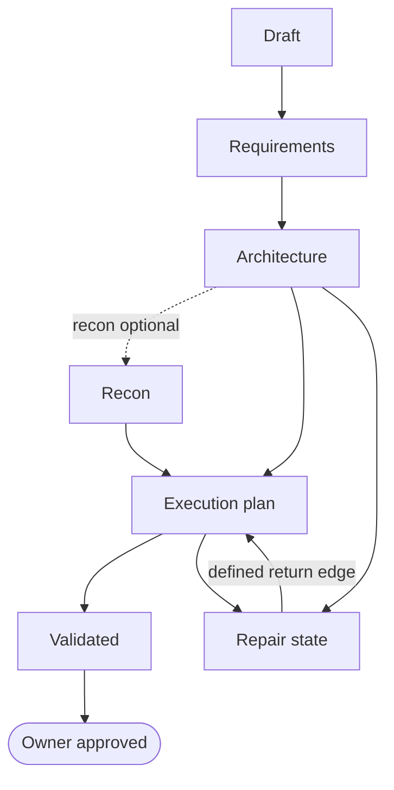

# The browser journey

What Bearing does between your work request and reviewable evidence, stage by stage.

## First launch

1. **Choose a repository.** One absolute path to a writable local directory.
   - A directory that is not a Git repository takes one-time owner confirmation
     and supports planning only. Focus execution validation needs Git.
   - Bearing rejects any directory holding agent executables, a home directory
     for instance, because the process-runner guard would block them.
   - On first initialization it discloses where durable state goes:
     `<repo>/.bearing/`, plus a visible `bearing-<plan>/` workspace at the
     repository root for a plan-bound run.
   - If `.gitignore` does not already ignore `.bearing/`, it offers once to add
     the rule and does so only with your consent. It never touches `.gitignore`
     otherwise.
2. **Choose a route.** One detected provider, model, and reasoning selection,
   shared across every role profile for the run. There are no per-role model
   choices. Reasoning is normalized into the provider-independent policy and
   resolved separately for each role.
3. **Complete the readiness check.** Detection is not verification, and an
   unavailable selection is blocked rather than silently substituted.
4. **Enter the work request and select Embark.** Bearing records the request,
   invokes the verified route, and starts the staged journey. Agent questions
   and owner answers land in the durable run ledger too.

## Real browser journey

Seven stages, each driven by the selected readiness-verified harness rather than
a canned workflow projection.

1. **Repository fit** runs before anything is written. Bearing reads the
   repository and proposes one repository and one plan directory, with the
   evidence behind the proposal.
   - Nothing is created yet: no plan directory, no plan stub, no repository map.
     Your recorded confirmation is what authorizes the first product write.
   - Decline it or name a different directory and no plan content is written.
     Bearing still records the run under `<repo>/.bearing/`, because that ledger
     is how a declined or interrupted journey stays recoverable.
   - If the agent is unavailable, answers malformed, or cannot defend a
     proposal, Bearing stops and asks rather than guessing.
2. **Set Bearings** starts the plan at the confirmed directory and returns
   validated plan artifacts. Without a recorded confirmation it refuses and
   creates nothing.
3. **Gather Supplies** asks the agent to inspect the repository once and return
   only questions that materially affect the plan. Bearing shows them one at a
   time with no further model call, then sends the whole answer set back in one
   writing call. **End questions** writes from what you have already answered
   plus explicitly recorded assumptions.
4. **Map the Route** produces the design, SEIT, and self-contained review
   baseline, then routes through an optional **Recon** stage before Bearing
   drafts `implementation.md`.
5. **Review your route** shows each slice's role and checks that every slice
   declares a role, a model route, a reasoning level, and a review path. A model
   or reasoning value it cannot resolve is rejected; the role name itself is not
   restricted to a supported set.
   - The regenerated review HTML embeds the complete planning package, and every
     source artifact also opens through a contained authenticated link.
   - You can request changes or approve. Implementation cannot start before
     approval.
6. **Choose the run shape.** Explorer or Expedition, Surveyor review cadence,
   and whether clean merged temporary worktrees are removed automatically.
   - Automatic cleanup instructs the harness to remove only clean, proven-merged
     temporary worktrees and their proven-merged temporary branches, and to keep
     dirty, blocked, failed, or unmerged lanes for recovery.
   - That instruction rides in the harness prompt. Bearing records your choice
     and states the rule, but does not verify afterwards that the harness obeyed
     it, and it has no arbitrary repository delete controls of its own.
7. **Execution and review.** The harness executes the approved route. Bearing
   then invokes native review where supported, falls back to a read-only
   Surveyor, and presents the cumulative validated artifacts.

### The planning state machine

Planning is a state machine, collapsed here from its thirteen states. The part
worth carrying is that **every failure has a defined return edge**, so nothing
dead ends, and owner approval is the only terminal state.


<details>
<summary>Diagram source</summary>



</details>

Five repair states are collapsed into one node above: requirements gap, design
conflict, recon failed, unsafe parallelism, and owner decision.

### Checking a plan before you run it

```sh
bearing plan validate docs/plans/account-export/phase-1
```

The command reads the four plan documents and prints a verdict plus every finding
with its code, artifact, slice, the text it objected to, the rule, and what to do
about it. It creates no run, writes no journey state, and changes nothing on
disk. Exit codes are 0 for a pass, 1 when the plan needs amending, 2 when a
finding needs an owner decision, and 3 when the input itself is unusable.

Two kinds of checks sit behind that verdict, and they are not equally strong.

**Structural checks are deterministic.** Required fields and sections, slice
heading formats, ID formats, write-set path safety, dependency cycles,
traceability closure, and same-wave write-set overlap are decided by parsing, so
they give the same answer every time. Coverage runs one way: a conformance test
feeds passing corpus fixtures through the real execution boundary and asserts the
boundary accepts them. The two are not identical, because the execution predicate
deliberately exempts several findings that the validator still reports, so treat
a structural pass as "the parser found nothing wrong", not as a guarantee that
every accepted plan is executable.

**Prose checks are heuristic, and some of them still block.** Whether a phase
names an accountable controller, whether a slice has a genuine independent review
path, and whether SEIT evidence actually asserts failing closed are judgments
about sentences, and a heuristic has a miss rate: it catches "no accountable
controller is assigned" but not every way English can say the same thing. Treat a
pass as "nothing obviously missing", not as proof. A failure is not always
advisory: `validation_missing` yields NEEDS_AMENDMENT, and `integration_unowned`,
`contract_ambiguous`, and `recon_recommended` yield OWNER_DECISION_REQUIRED.

A passing verdict never authorizes execution on its own. Owner approval is still
required, and approval is what the run is gated on.

### What a generated plan declares

**The planning agent writes these** under the Map the Route and Gather Supplies
contracts, so they are not markup you author. Bearing checks each one only when
it is present, which keeps older and hand-edited plans from being rejected after
the fact. A plan that declares nothing is never rejected for omitting one, and a
plan that declares one is held to it. Read the table as reference for reviewing a
plan.

| Declaration | Artifact | Checked for |
|---|---|---|
| `## Risk Profile` | plan-spec.md | `risk_coverage_missing` |
| `## System Catalog` | design.md | `system_spec_missing`, `system_trace_broken` |
| `### SEIT-<id>` narratives | seit.md | `procedure_mismatch` |
| `**Shared interfaces.**` | slice manifest | `shared_contract_unproduced` |
| `#### Lane <id>` | execution manifest | Bounds the Focus envelope to that lane |

In detail:

- **`## Risk Profile`** in `plan-spec.md` declares typed risk flags such as
  `moves_money`, `multi_tenant`, `public_api_or_sdk`, or `agentic_tools`. Every
  flag set to yes needs cross-artifact coverage, meaning a non-empty design
  section or catalogued system, a SEIT proof row, and a slice reference, or else
  an evidence-backed rationale saying why it does not apply. Deferral language and
  a bare "not applicable" are rejected. Gaps report `risk_coverage_missing`.
- **`## System Catalog`** in `design.md` declares systems with stable `SYS-`
  ids, each needing a `### SYS-<id>` specification with its required fields.
  Missing specifications report `system_spec_missing`; a `SYS-` reference that
  resolves to nothing, or a `## Requirement Trace` row that does not close,
  reports `system_trace_broken`.
- **`### SEIT-<id>` procedure narratives** under the seit procedures section
  bind a traceability row to the procedure that proves it. Once a plan titles
  one procedure with a row id, every executable row must resolve to exactly one
  narrative whose command, positive case, negative case, and evidence target
  match the row. Drift reports `procedure_mismatch`. Plans whose procedures are
  unkeyed prose are untouched.
- **`**Shared interfaces.**`** in a slice manifest names `path#symbol`
  identifiers. A declared producer path that no slice write set covers reports
  `shared_contract_unproduced`, because the implementer could not satisfy the
  slice inside Focus containment.
- **`#### Lane <dotted-id>`** blocks inside an execution manifest split one
  slice into serialized Crewmate lanes. Selecting a lane bounds the Focus
  envelope to that lane's own write set and command ids, so an honest
  intermediate lane can produce a valid receipt. A lane may not widen its
  parent slice's authority.

Two further findings need no declaration. `command_unbound` and
`dependency_unowned` report unresolved command ids and unowned manifest
dependencies. `slice_scope_advisory` notes a slice whose declared text exceeds
roughly 500 estimated tokens; it is an ergonomic aim rather than a prediction
of effort, it stays advisory, and the verdict remains PASS.

### Plan directories

Plans live under `docs/plans/` in the selected repository. A plan directory may
be up to three segments deep, so a multi-phase program can keep its phases
together; `docs/plans/account-export/phase-1/` is valid. Each segment starts
with a letter or digit and may otherwise contain letters, digits, `.`, `_`, and
`-`, up to 64 characters. No spaces. A date prefix is optional rather than
required.

Name a directory that already exists and Bearing resumes it, creating no sibling.
If the name matches more than one directory, Bearing lists the matches and asks;
it never picks one for you, and no plan content is written while it waits, though
the pending question and run checkpoint are recorded under `.bearing/`.

Consolidating duplicate plan directories is reachable from the browser. When
Repository Fit finds a duplicate matching the confirmed plan name, Bearing asks
before doing anything, and the copy runs only after you approve it.

While an agent call is pending, Bearing shows the phase name, a moving trail,
contextual guidance, elapsed time, and only artifacts already validated by
completed results. It invents no percentage, no activity detail, and no ETA.

A failure never becomes a success claim. Eligible failures stay retryable, but
retry policy can refuse one for a missing warrant, a reasoning-only repetition,
lost continuity, or too many equivalent failures.

Execution can pause when the selected agent reaches a blocker or needs owner authorization. Bearing preserves the journey and reports what stopped, why, a recommended next step, and the decision it needs.

[Back to the README](../README.md)
